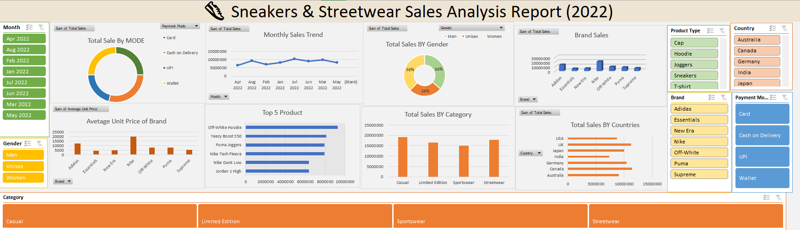

# 👟 Sneakers & Streetwear Sales Analysis Report (2022)

This repository contains an **interactive sales analysis dashboard** built using **Microsoft Excel**.  
The dashboard provides a detailed analysis of sneakers and streetwear sales performance across different brands, categories, countries, and customer segments.

---

## 📌 Project Overview

The **Sneakers & Streetwear Sales Analysis Dashboard** offers insights into sales trends, top products, brand performance, and customer preferences.  
It helps retail managers, analysts, and decision-makers track performance and identify growth opportunities.

---

## ✅ Key Features

- 💳 **Total Sales by Payment Mode**  
  Donut chart showing distribution across Card, Cash on Delivery, UPI, and Wallet.

- 📈 **Monthly Sales Trend**  
  Line chart showing monthly total sales across the year.

- 🚻 **Total Sales by Gender**  
  Donut chart displaying the share of sales for Men, Women, and Unisex products.

- 🏷 **Brand Sales**  
  Column chart showing sales for top sneaker and streetwear brands.

- 💰 **Average Unit Price by Brand**  
  Bar chart comparing average prices across different brands.

- 🏆 **Top 5 Products**  
  Horizontal bar chart listing the five best-selling products.

- 📦 **Total Sales by Category**  
  Column chart showing sales across Casual, Limited Edition, Sportswear, and Streetwear.

- 🌍 **Total Sales by Country**  
  Bar chart ranking countries by sales volume.

- 🎛 **Interactive Slicers**  
  - Month  
  - Gender  
  - Product Type  
  - Country  
  - Brand  
  - Payment Mode  
  - Category

---

## 🧠 Insights You Can Derive

- Identify **top-performing brands and products**.
- Track **sales growth trends** month by month.
- Compare **average pricing strategies** of different brands.
- See **customer preferences** by gender and payment mode.
- Analyze **geographical sales distribution**.

---

## 🛠️ Built With

- **Microsoft Excel**
  - Pivot Tables
  - Pivot Charts
  - Donut, Line, Column, and Bar Charts
  - Slicers for interactivity
  - Custom formatting and dashboard design

---

## 📂 How to Use

1. Download or clone this repository.
2. Open the Excel file in **Microsoft Excel (2016 or later)**.
3. Use slicers to filter data by:
   - Month
   - Gender
   - Product Type
   - Country
   - Brand
   - Payment Mode
   - Category
4. Interact with the charts to explore the dataset dynamically.

---
